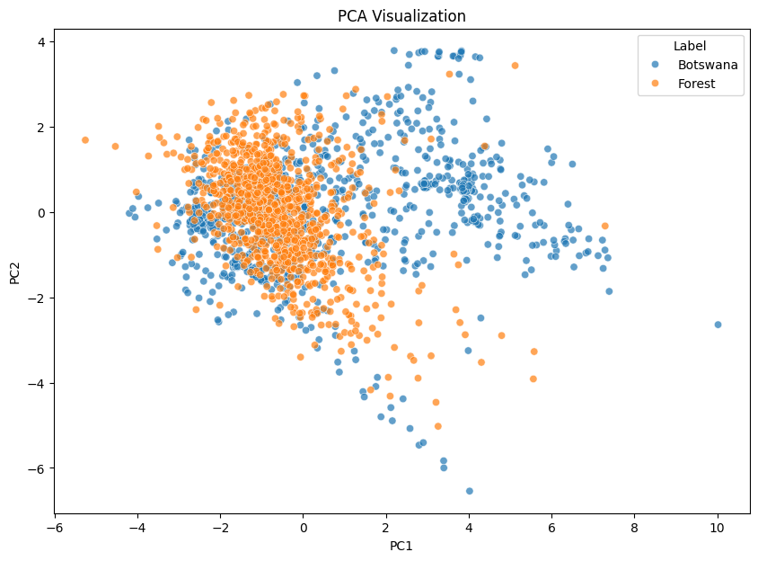
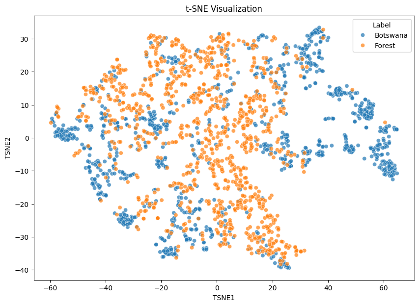
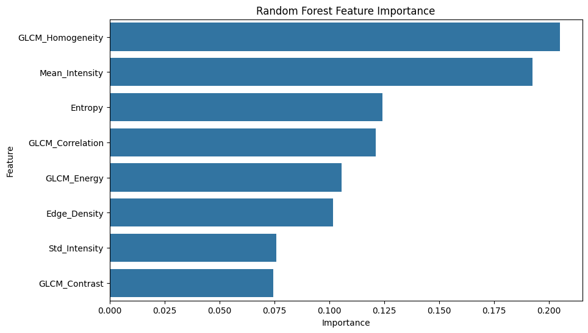
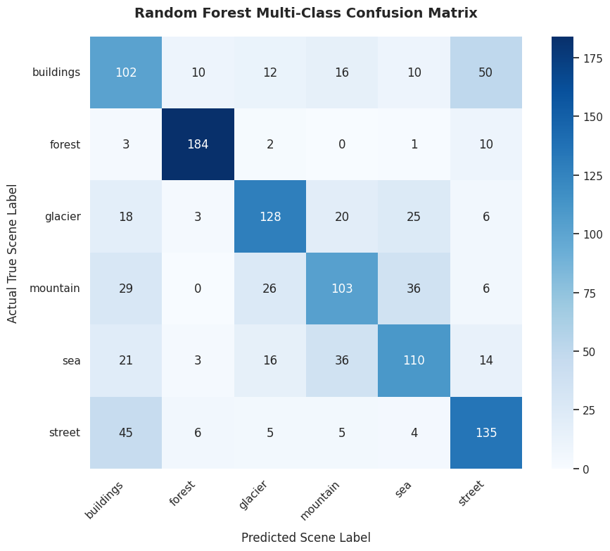
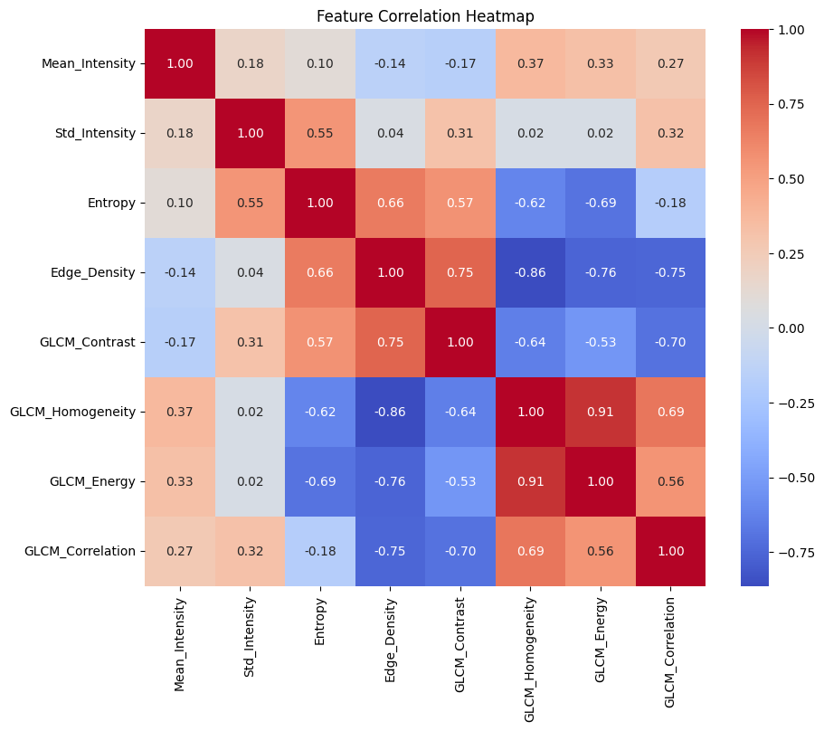

# Natural Image Statistics for Scene Classification


## Overview

This repository contains research work conducted at IIT Guwahati on the use of handcrafted statistical, texture, and colour descriptors for natural scene classification.

The project investigates an important question in computer vision:

> How far can interpretable handcrafted image features go before deep learning becomes necessary?

The work was conducted in two phases. Phase 1 established a baseline using simple statistical descriptors, while Phase 2 enriched the representation using texture and colour features and evaluated the resulting performance improvements.

---

## Research Motivation

Natural images exhibit structured statistical properties such as:

- Pixel intensity distributions
- Spatial correlations
- Frequency-domain characteristics
- Edge density
- Texture patterns
- Colour distributions

This project explores whether these properties can be used to classify natural scenes without relying on deep neural networks.

---

# Phase 1: Statistical Image Analysis

## Features Used

- Mean Intensity (Brightness)
- Standard Deviation (Contrast)
- Edge Density
- Spatial Correlation

## Classification Models

- Logistic Regression
- Support Vector Machine (SVM)
- Random Forest

## Datasets

### Binary Classification

- Botswana Savanna Dataset
- Indian Forest Dataset

### Multi-Class Classification

Intel Scene Classification Dataset

Classes:

- Buildings
- Forest
- Glacier
- Mountain
- Sea
- Street

# Phase 2: Enriched Feature Representation

Phase 1 revealed a key limitation:

> The bottleneck was not the classifier, but the feature representation.

To address this, Phase 2 introduced additional handcrafted descriptors.

## Additional Features

### Statistical Features

- Shannon Entropy

### Texture Features (GLCM)

- GLCM Contrast
- GLCM Homogeneity
- GLCM Energy
- GLCM Correlation

### Colour Features

- Mean Hue
- Hue Standard Deviation
- Mean Saturation

## Additional Analysis

- Mann–Whitney U Test
- Kruskal–Wallis H Test
- Principal Component Analysis (PCA)
- t-SNE Visualization
- Feature Importance Analysis
- Error Analysis
- 5-Fold Cross Validation

---

# Results Summary

| Phase | Task | Best Model | Accuracy |
|--------|--------|--------|--------|
| Phase 1 | Binary Classification | Logistic Regression | 100.0% |
| Phase 1 | Multi-Class Classification | Logistic Regression | 52.5% |
| Phase 2 | Binary Classification | Random Forest | 89.0% |
| Phase 2 | Multi-Class Classification | RBF-SVM | 64.7% |

---

# Phase 2 Detailed Results

## Binary Classification

| Model | Accuracy (%) |
|---------|---------|
| Logistic Regression | 76.3 |
| SVM (RBF) | 83.3 |
| Random Forest | 89.0 |

## Multi-Class Classification

| Model | Accuracy (%) |
|---------|---------|
| Logistic Regression | 61.4 |
| Random Forest | 63.5 |
| RBF-SVM | 64.7 |

# Key Findings

- Richer feature representations significantly improve classification performance.
- Texture descriptors contribute more than classifier complexity.
- Forest scenes are highly distinguishable from other categories.
- Buildings, streets, glaciers, mountains, and sea categories exhibit substantial overlap.
- The main limitation of handcrafted features is the lack of spatial layout information.
- Feature engineering improved Intel Scene Classification accuracy from 52.5% to 64.7% without using deep learning.

---

# PCA Visualization



---

# t-SNE Visualization



---

# Feature Importance Analysis



---

# Multi-Class Confusion Matrix



---

# Correlation Analysis



## Repository Structure

```text
natural-image-statistics

├── notebooks
│   ├── phase1_analysis.ipynb
│   ├── phase2_binary_classification.ipynb
│   └── phase2_multiclass_classification.ipynb

├── reports
│   ├── phase1_report.pdf
│   └── phase2_report.pdf

├── results
│   ├── pca_visualization.png
│   ├── tsne_visualization.png
│   ├── feature_importance.png
│   ├── binary_correlation_heatmap.png
│   └── multi_class_confusion_matrix_random_forest.png

├── requirements.txt
└── README.md
```

---

# Technologies Used

- Python
- NumPy
- Pandas
- OpenCV
- Scikit-Learn
- Scikit-Image
- SciPy
- Matplotlib
- Seaborn
- Google Colab

---

# Future Work

Potential future directions include:

- Local Binary Patterns (LBP)
- Block-wise GLCM Features
- Multi-scale Frequency Analysis
- Convolutional Neural Networks (CNNs)
- Vision Transformers (ViTs)
- Feature Selection and Hyperparameter Optimization

---

# Author

Akash Chauhan

B.Sc. (Honours) Data Science and Artificial Intelligence

Indian Institute of Technology Guwahati

Research Internship Project under the guidance of Prof. Neeraj Kumar Sharma at SPIN Lab, IIT Guwahati.
